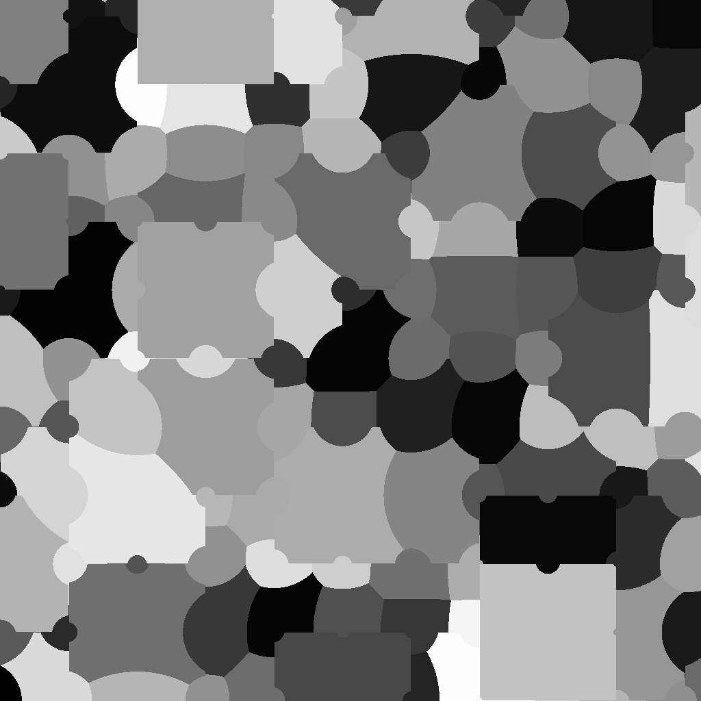
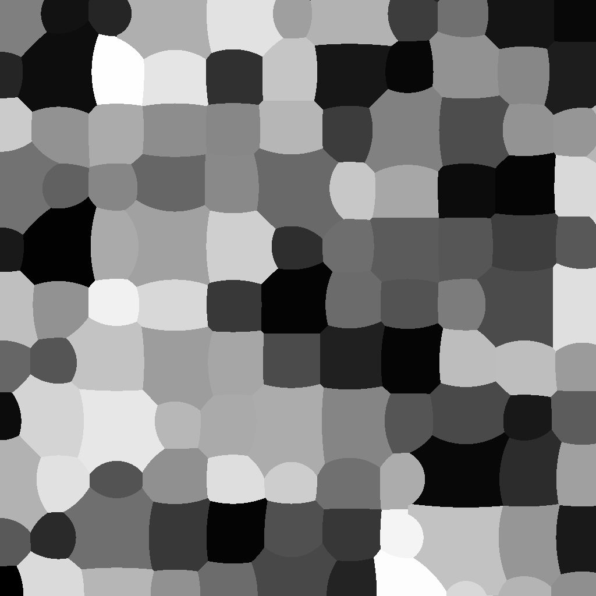
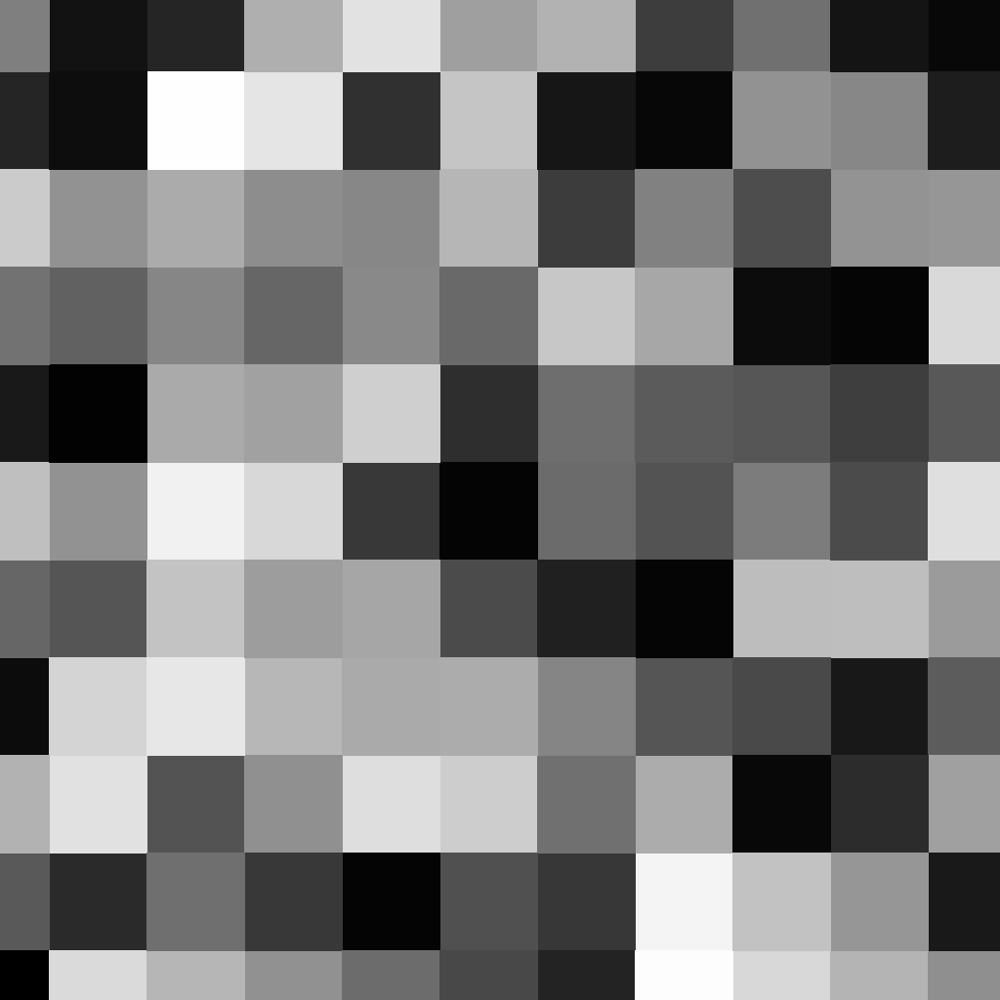
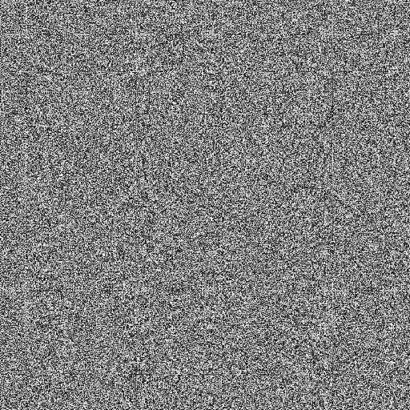

# NoiseMapLibrary

Небольшая библиотека карт шумов для движка Unity. Всего карт шумов 2: обычный 2D шум и созданный мною Камуфляжный шум.

## Камуфляжный Шум

|  |  |  |
|------------------------------------------|------------------------------------------|------------------------------------------|
| centralizationPower = 0                  |     centralizationPower = 1              |         centralizationPower = 100        |

Камуляжный шум представляет из себя карту псвевдослучайных форм, формы заполняются также псевдослучайными значениями.

Для получения значения точки на карте шума нужно обратиться к методу `CamouflageNoise()` задав два аргумента на входе `x` и `y`, после чего метод вернёт вычисленное значение.

### Как работает метод `CamouflageNoise()`:

Получив значения `x` и `y`, что образуют собой позицию нашей точки, метод начинает определять внутри какого квадрата находится эта самая точка.
Путём получения позиций точек квадрата, которые мы находим, округляя вверх и вниз значения `x` и `y`.

Возымев позиции точек квадрата мы обращаемся к методу `NoiseMap()`(указывая в аргументах наши округлённые значения `x` и `y`) для каждой точки квадрата, чтобы назначить им случайное значение(назовём это цветом точки) и случайную силу влияния.
Имея нужные значения, метод начинает определять к какой точке квадрата принадлежит наша точка, высчитывая расстояния до каждой точки квадрата и уменьшая итоговое значения за счёт силы влияния точки квадрата. Определив точку квадрата, что имеет достаточно малое расстояние до нашей точки и достаточно сильное влияние, он возвращает цвет этой точки.

Также, в методе `CamouflageNoise()`, есть 3-й аргумент `centralizationPower`, отвечающий за разнообразие сил влияния каждой точки сетки. Чем выше значение в `centralizationPower`, тем сильнее все значения сжимаются к среднему значению. 

## 2D Шум

2D Шум представляет из себя обыкновенный шум из псевдослучайных чисел с низкой энтропией.

Для получения значения точки на карте шума нужно обратится к методу `NoiseMap()`, вписав в его аргументы значения типа float для позиции `x` и `y`.
